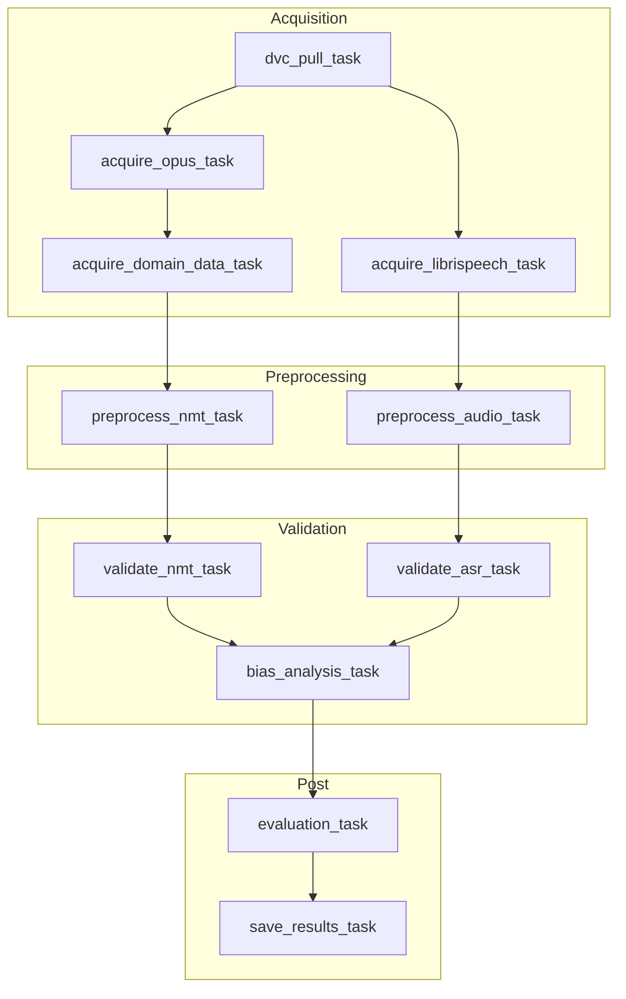
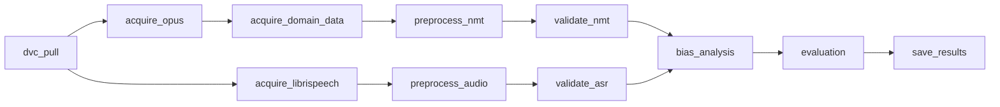
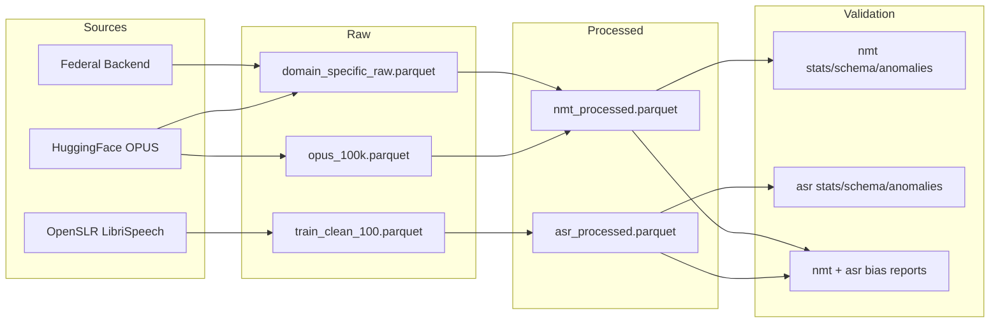

# MLOps Course: Data Pipeline Submission
## Live Speech Interpreter — End-to-End ASR & NMT Data Pipeline

---

## 1 Overview

This document describes the data pipeline for the **Live Speech Interpreter** project — a real-time speech-to-speech translation system for Spanish ↔ English. The pipeline is implemented as an Apache Airflow DAG and covers data acquisition, preprocessing, validation (TFDV), versioning (DVC), and workflow orchestration.

**Pipeline Summary:**
- **Data Acquisition:** OPUS-100 (100k en–es pairs), LibriSpeech (train-clean-100), domain-specific medical/federal data
- **Preprocessing:** Audio (silence trim, resample 16kHz, mel spectrograms); NMT (dedup, HTML removal, length filter, Gemma-3 tokenization)
- **Validation:** TensorFlow Data Validation (TFDV) for schema inference, statistics, and anomaly detection
- **Bias Detection:** Data slicing by domain (NMT) and text length (ASR); SliceFinder-style analysis with imbalance detection and mitigation recommendations
- **Orchestration:** Apache Airflow 2.10.4 with 11 tasks in a DAG
- **Versioning:** DVC for processed data (`processed.dvc`)

---

## 2 Key Components

### 2.1 Data Acquisition

| Source | Script | Description |
|--------|--------|-------------|
| OPUS-100 (en-es) | `scripts/acquire/acquire_opus.py` | Fetches 100k pairs via HuggingFace `datasets` |
| LibriSpeech | `scripts/acquire/acquire_librispeech.py` | Downloads 6.3GB tar from OpenSLR, converts FLAC → Parquet |
| Domain (Medical/Federal) | `scripts/acquire/acquire_domain_data.py` | OPUS medical keywords + federal backend data |

**Dependencies:** `datasets`, `requests`, `soundfile` (see `requirements.txt`). All external sources are documented; execution is reproducible via `requirements.txt` and `.env` (HuggingFace token).

---

### 2.2 Data Preprocessing

| Pipeline | Script | Steps |
|----------|--------|-------|
| **ASR (Audio)** | `scripts/pre_process/preprocess_audio.py` | Silence trim (20 dB), resample 16 kHz, normalize amplitude, extract 80-bin log-mel spectrograms |
| **NMT (Text)** | `scripts/pre_process/preprocess_nmt.py` | Deduplication, HTML removal, length ratio filter (max 3×), Gemma-3 tokenization (max 128 tokens) |

Both scripts are modular: `AudioPreprocessor` and `NMTPreprocessor` classes can be reused. Paths use `project_root` for portability.

---

### 2.3 Test Modules

| Test File | Coverage |
|-----------|----------|
| `scripts/tests/test_nmt.py` | Empty pair removal, length ratio filter, deduplication, HTML stripping, tokenization |
| `scripts/tests/test_audio.py` | Full NMT pipeline (dedup + HTML + tokenization), edge cases |
| `scripts/tests/test_bias.py` | Data slicing, imbalance detection, mitigation recommendations |

**Framework:** `unittest`. Run with: `pytest scripts/tests/` or `python -m pytest scripts/tests/`.

---

### 2.4 Pipeline Orchestration (Airflow DAGs)

The DAG `live_speech_interpreter_pipeline` is defined in `dags/airflow_live_speech_interpreter.py`.

#### Pipeline Flow Diagram



#### Task Dependency Graph



**Parallelization:** `acquire_opus` and `acquire_librispeech` run in parallel after `dvc_pull`. ASR and NMT branches merge at `bias_analysis_task`, then `evaluation_task`.

---

### 2.5 Data Versioning with DVC

- **File:** `processed.dvc` tracks the `data/processed` directory
- **Usage:** `dvc_pull_task` attempts `dvc pull` at pipeline start; skips gracefully if DVC is not initialized
- **Storage:** Configured for Google Cloud Storage (`dvc-gs`). Git tracks `.dvc` files and `dvc.yaml` for reproducibility

---

### 2.6 Tracking and Logging

- **Python logging:** All scripts use `logging.basicConfig` with `%(asctime)s - %(levelname)s - %(message)s`
- **Airflow:** Each task logs `[DEBUG]` lines (script path, project root, stdout/stderr, exit code)
- **TFDV:** Anomaly reports and validation artifacts written to `data/validation/`

---

### 2.7 Data Schema & Statistics (TFDV)

| Output | Location |
|--------|----------|
| NMT raw stats | `data/validation/nmt/raw_nmt_stats.pb` |
| NMT raw schema | `data/validation/nmt/raw_nmt_schema.pbtxt` |
| NMT processed stats | `data/validation/nmt/processed_nmt_stats.pb` |
| NMT processed schema | `data/validation/nmt/processed_nmt_schema.pbtxt` |
| ASR raw stats | `data/validation/asr/raw_asr_stats.pb` |
| ASR raw schema | `data/validation/asr/raw_asr_schema.pbtxt` |
| ASR processed stats | `data/validation/asr/processed_asr_stats.pb` |
| ASR processed schema | `data/validation/asr/processed_asr_schema.pbtxt` |
| Spectrogram stats | `data/validation/asr/spectrogram_stats.json` |

**Validation logic:** Raw schema inferred from raw data; processed data validated against raw schema to detect drift and new columns.

---

### 2.8 Anomaly Detection & Alerts

| Mechanism | Implementation |
|-----------|----------------|
| **TFDV anomaly detection** | `validate_nmt.py`, `validate_asr.py` — missing features, out-of-range values, schema drift |
| **Anomaly reports** | `nmt_anomalies.json`, `asr_anomalies.json` with severity, feature, and description |
| **Airflow failure handling** | Tasks raise `Exception` on non-zero exit; Airflow marks run as failed and surfaces logs |

**Alert integration:** Pipeline raises on anomalies; email/Slack can be enabled via `default_args` (`email_on_failure`, etc.).

---

### 2.9 Pipeline Flow Optimization

| Optimization | Implementation |
|--------------|----------------|
| **Parallel acquisition** | `acquire_opus` and `acquire_librispeech` run concurrently |
| **Chunked processing** | LibriSpeech conversion uses `batch_size=200` to avoid OOM |
| **Memory-efficient ASR** | Audio preprocessing reads Parquet in row groups |
| **Airflow Gantt chart** | Use Airflow UI → DAG → Gantt tab to inspect bottlenecks |

---

## 3 Data Bias Detection Using Data Slicing

### 3.1 Detecting Bias in Your Data

We perform **data slicing** and analyze distribution across subgroups to ensure data is not biased. Categorical and derived features are identified, and representation/imbalance are evaluated.

| Dataset | Slice Dimension | Description |
|---------|-----------------|-------------|
| **NMT** | `domain` | general, medical, federal |
| **NMT** | `length_bin` | short (1–10), medium (11–30), long (31+ words) |
| **ASR** | `text_length_bin` | short (1–5), medium (6–15), long (16+ words) |
| **ASR** | `speaker_id`, `chapter_id` | For multi-dimensional analysis |

**Bias detection rules:**
- **Representation bias:** Slices &lt; 5% of data → underrepresented
- **Dominance bias:** Slices &gt; 95% of data → overrepresented
- **Skew bias:** max/min slice ratio &gt; 10× → imbalance

### 3.2 Data Slicing Implementation

We implement SliceFinder-style slicing in `scripts/bias/data_slicing.py`. Tools like SliceFinder, TFMA, and Fairlearn require a trained model; our pipeline performs **data-level** analysis before training. The implementation:

1. Splits data by categorical features (domain, text length)
2. Computes per-slice statistics (count, fraction, mean metrics)
3. Flags underrepresented/overrepresented slices
4. Produces JSON reports for downstream Fairlearn/TFMA integration

**Output:** `data/validation/bias/nmt_bias_report.json`, `asr_bias_report.json`

**Run:** `python scripts/bias/run_bias_analysis.py` or via Airflow `bias_analysis_task`.

### 3.3 Mitigation of Bias

| Technique | Implementation |
|-----------|----------------|
| **Re-sampling underrepresented groups** | Oversample slices &lt; 5%; use `sample_weight` ∝ 1/frequency |
| **Re-sampling overrepresented groups** | Undersample dominant slices or collect more minority data |
| **Fairness constraints** | Use Fairlearn/TFMA per-slice evaluation once model exists; post-process (threshold tuning) |
| **Document trade-offs** | Record fairness–accuracy trade-off and stakeholder approval |

### 3.4 Document Bias Mitigation Process

**Steps taken:**
1. Identify slice dimensions (domain, length, speaker)
2. Implement slicing in `data_slicing.py` with configurable thresholds
3. Integrate into DAG: `[validate_nmt, validate_asr] >> bias_analysis >> evaluation`
4. Preserve `domain` in NMT preprocessing for slicing
5. Generate reports and mitigation recommendations

**Types of bias found (typical):**
- Representation bias: medical/federal domains smaller than general OPUS
- Skew bias: short utterances may dominate ASR data

**Trade-offs:** Oversampling can increase training time and overfitting risk; we recommend importance weighting over aggressive resampling. See `docs/BIAS_MITIGATION.md` for details.

### 3.5 Bias Report Sample Output

**NMT bias report (`data/validation/bias/nmt_bias_report.json`):**

```json
{
  "dataset_name": "NMT (en-es)",
  "total_samples": 125000,
  "slice_dimension": "domain",
  "slices": [
    {"slice_name": "general", "count": 98000, "fraction": 0.784, "is_underrepresented": false, "is_overrepresented": true},
    {"slice_name": "medical", "count": 12000, "fraction": 0.096, "is_underrepresented": false, "is_overrepresented": false},
    {"slice_name": "federal", "count": 15000, "fraction": 0.12, "is_underrepresented": false, "is_overrepresented": false}
  ],
  "imbalance_detected": false,
  "skew_ratio": 8.17,
  "bias_types_found": [],
  "mitigation_recommendations": ["Fairness constraints: Once a model is trained...", "Document trade-offs..."]
}
```

**ASR bias report (`data/validation/bias/asr_bias_report.json`):**

```json
{
  "dataset_name": "ASR (LibriSpeech)",
  "total_samples": 28539,
  "slice_dimension": "text_length_bin",
  "slices": [
    {"slice_name": "short", "count": 4200, "fraction": 0.147, "metrics": {"text_word_count": 3.2}, "is_underrepresented": false, "is_overrepresented": false},
    {"slice_name": "medium", "count": 18000, "fraction": 0.631, "metrics": {"text_word_count": 10.5}, "is_underrepresented": false, "is_overrepresented": true},
    {"slice_name": "long", "count": 6339, "fraction": 0.222, "metrics": {"text_word_count": 22.1}, "is_underrepresented": false, "is_overrepresented": false}
  ],
  "imbalance_detected": false,
  "skew_ratio": 4.29,
  "bias_types_found": ["Dominance bias: 1 slice(s) overrepresented"],
  "mitigation_recommendations": ["Re-sampling: Consider undersampling overrepresented slice(s) [medium]..."]
}
```

---

## 4 Project Structure

```
livespeechinterpreter/
├── dags/
│   └── airflow_live_speech_interpreter.py   # Airflow DAG
├── data/
│   ├── raw/
│   │   ├── librispeech/                      # LibriSpeech parquet
│   │   ├── opus/                            # OPUS-100 parquet
│   │   └── domain_data/                     # Domain-specific parquet
│   ├── processed/
│   │   ├── asr_processed.parquet
│   │   └── nmt_processed.parquet
│   └── validation/
│       ├── nmt/                             # TFDV outputs
│       ├── asr/
│       └── bias/                            # Data slicing reports
├── scripts/
│   ├── bias/
│   │   ├── data_slicing.py                  # Slice analysis logic
│   │   └── run_bias_analysis.py             # Bias analysis entry point
│   ├── acquire/
│   │   ├── acquire_opus.py
│   │   ├── acquire_librispeech.py
│   │   └── acquire_domain_data.py
│   ├── pre_process/
│   │   ├── preprocess_audio.py
│   │   └── preprocess_nmt.py
│   ├── validation/
│   │   ├── validate_nmt.py
│   │   └── validate_asr.py
│   └── tests/
│       ├── test_nmt.py
│       ├── test_audio.py
│       └── test_bias.py
├── .env                                     # HF_TOKEN (gitignored)
├── Dockerfile                               # Custom Airflow + TFDV
├── requirements.txt
├── requirements-docker.txt
├── processed.dvc
└── README.md
```

---

## 5 Data Flow Diagram



---

## 6 Evaluation Criteria Mapping

| Criterion | Implementation |
|-----------|----------------|
| **Documentation** | README, this submission doc, inline comments |
| **Modular code** | `NMTPreprocessor`, `AudioPreprocessor`, separate acquire/preprocess/validation scripts |
| **Airflow DAGs** | `live_speech_interpreter_pipeline` with 11 tasks |
| **Tracking & logging** | Python logging + Airflow task logs |
| **DVC** | `processed.dvc`, `dvc_pull_task` |
| **Gantt optimization** | Airflow Gantt tab; parallel acquisition; chunked processing |
| **Schema & stats (TFDV)** | `validate_nmt.py`, `validate_asr.py` — raw + processed stats/schema |
| **Anomaly detection** | TFDV anomaly reports → JSON + txt |
| **Bias detection** | Data slicing by domain/text length; imbalance detection; mitigation recommendations |
| **Unit tests** | `test_nmt.py`, `test_audio.py`, `test_bias.py` |
| **Reproducibility** | Docker image, `requirements.txt`, `.env` template, README run instructions |
| **Error handling** | Exception on script failure; DVC pull graceful skip |

---

## 7 Reproducibility

### Run Locally (Docker)

```bash
# Build
docker build --platform linux/amd64 -t live-speech-airflow:latest .

# Run
docker run -d --platform linux/amd64 --name airflow -p 8080:8080 \
  -v "$(pwd)/dags:/opt/airflow/dags" \
  -v "$(pwd)/scripts:/opt/airflow/scripts" \
  -v "$(pwd)/data:/opt/airflow/data" \
  -v "$(pwd)/.env:/opt/airflow/.env" \
  -e AIRFLOW__CORE__LOAD_EXAMPLES=false \
  live-speech-airflow:latest standalone
```

### Environment

- `.env`: `HF_TOKEN=<your_huggingface_token>` for Gemma tokenizer
- `requirements.txt`: All Python dependencies
- `requirements-docker.txt`: Subset for Docker image (includes TFDV)

---

## 8 TFDV Sample Outputs

**NMT anomalies (excerpt):**

```json
{
  "anomaly_count": 5,
  "features_with_anomalies": [
    {"feature": "es_word_count", "short_description": "Out-of-range values", "description": "Unexpectedly large value: 551.", "severity": "ERROR"},
    {"feature": "en_token_count", "short_description": "New column", "description": "New column (column in data but not in schema)", "severity": "ERROR"},
    {"feature": "en_word_count", "short_description": "Out-of-range values", "description": "Unexpectedly large value: 609.", "severity": "ERROR"}
  ]
}
```

**ASR spectrogram stats (excerpt):**

```json
{
  "sample_size": 20,
  "mean": {"avg": -53.71, "std": 2.25},
  "std_dev": {"avg": 17.92, "std": 0.68},
  "min_value": {"avg": -80, "min": -80},
  "max_value": {"avg": 1.9e-7, "max": 1.9e-6},
  "frame_count": {"avg": 1397, "min": 861, "max": 1591}
}
```

---

*Document generated for MLOps Course Data Pipeline Submission — Live Speech Interpreter.*
